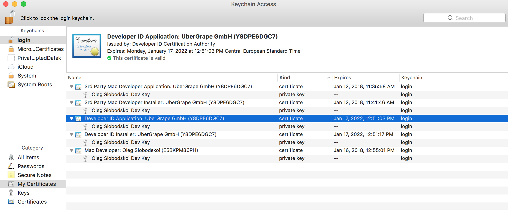

# Electron Build Instructions

## Common

Use Node 8

```
nvm use 8
```

```bash
git clone git@github.com:ubergrape/grape-electron.git
cd grape-electron
yarn
yarn release
```

The result will be an executable (`dmg`, `app`, `exe`) and installer (`msi`, `pkg`) file in `./releases` with version suffix from from `/app/package.json`. Version from `/package.json` is not used anywhere.

- Unsigned release is for development only. \*

## App signing

### MacOS

You need to sign a release to:

- upload it to MacOS AppStore
- create a signed release for a distribution without store
- create and install all certificates from developer.apple.com

  

  http://stackoverflow.com/questions/29039462/which-certificate-should-i-use-to-sign-my-mac-os-x-application

- Download provision profiles and put them into the root:
  - Developer_Distribution.provisionprofile
  - AppStore_Distribution.provisionprofile
- Increment [build number](https://github.com/ubergrape/grape-electron/blob/master/app/package.json#L7) for each review upload (you can upload same version multiple times if the review failed, but the build number should be unique all the time, don't reset this number ever, even for new version)

- Signed store release `yarn release -- --sign {teamId} --mas`
- Signed distribution outside of store `yarn release -- --sign {teamId}`

  To sign the app you first need to get a certificate from Apple as described here: https://github.com/electron/electron/blob/master/docs/tutorial/mac-app-store-submission-guide.md#get-certificate

- Use "Application Loader" app to upload the package to the store.
- Go to https://itunesconnect.apple.com and publish it.

### Windows

In order to sign you need a certificate, thumbprint and token passwork.

Certificate located on USB security token, you can find it at office.
To use it, simply plug-in it to USB port and install SafeNet client that you can find [here](https://support.sectigo.com/Com_KnowledgeDetailPage?Id=kA01N000000zFLx).

SafeNet will ask a token password while signing. Token password you can get from @sk7.

To find thumbprint do following steps:
- plug-in security token an mount it (if you're using virtual machine)
- open SafeNet client
- click "Advanced View" (icon like settings wheel)
- go to "Tokens"
- go to "User certificates"
- click twice to "UberGrape GmbH"
- open "Details" path
- "Thumbprint" field will be last at list

Run this command to create signed builds:
```
yarn release -- --thumbprint THUMBPRINT
```

We have a pre configured Windows 10 image that you can find by this [link](https://drive.google.com/open?id=1RAozPUdoTJnvoF9BeNUUFbiBJQNILDyF) or in external drive at office. If you setting up your own environment, follow set up guide for Windows below.

## Windows set up

Otherwise you need to:

- install 32bit node (last safe version is `8.16.0`)
- install git or download source
- install latest [WiX](http://wixtoolset.org/)
  - add path to `bin` folder (usually it will be `C:\Program Files\WiX Toolset v3.9\bin\`) to `Path` variable. [See instructions](http://www.nextofwindows.com/how-to-addedit-environment-variables-in-windows-7)
- install [microsoft windows sdk for win7](https://www.microsoft.com/en-us/download/details.aspx?id=8279)
  - add path to `bin` folder (usually it will be `C:\Program Files\Microsoft SDKs\Windows\v7.1\Bin`) to `Path` variable. [See instructions](http://www.nextofwindows.com/how-to-addedit-environment-variables-in-windows-7)
- fix the [msvcp120.dll issue](https://www.google.com.ua/webhp?sourceid=chrome-instant&ion=1&espv=2&ie=UTF-8#q=msvcp120+dll+windows) (only for windows 7)

steps with [`choco`](https://chocolatey.org/) (**WIP**)

- open cmd (right click) with admin permissions and install chocolatey first.

```
choco install git
choco install nodejs.install
choco install wixtoolset # doesn't work or at least PATH entry is missing
choco install windows-sdk-10.1
```

---

When your env is ready or VM is up, use **Common** instructions above.
